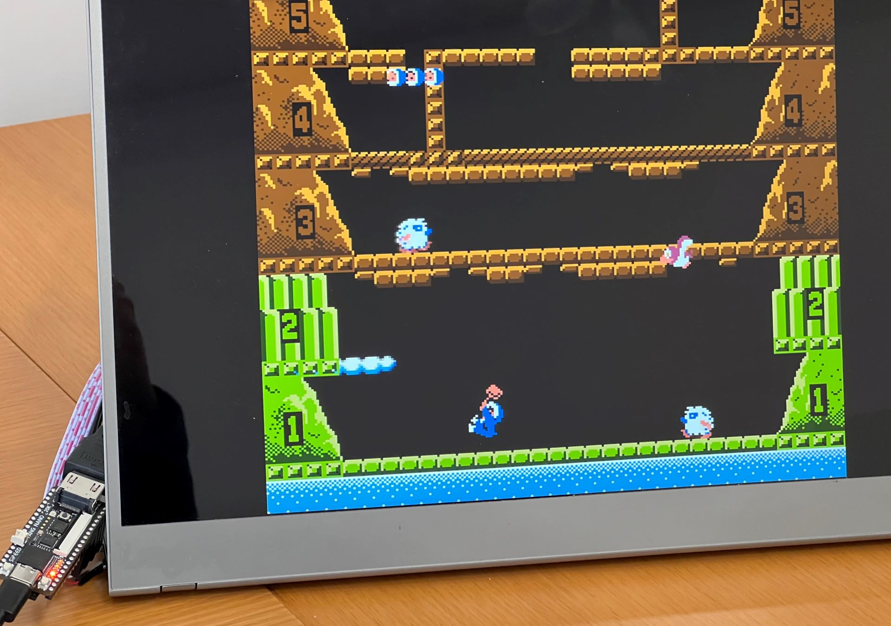

# Home

NESTang is an FPGA Nintendo Entertainment System implemented with the affordable Sipeed Tang Nano 20K and Tang Primer 20K boards.

Main features,

<table style="border: 0px; font-size: 1em;">
<tr>
<td width="50%" style="border: 0px;">
HDMI video and sound 
NES games look sharp in 720p HD resolution
</td>
<td width="50%" style="border: 0px;">
Cycle accurate quality 
We nearly recreated the NES circuits with FPGA
</td>
</tr>
<tr>
<td width="50%" style="border: 0px;">
Retro controller support 
Connect a ps2 controller directly to the board, or use your PC game controller
</td>
<td width="50%" style="border: 0px;">
Open source 
A good way to learn FPGA programming
</td>
</tr></table>

Interested? You can start by [downloading](downloads) a NESTang release, then [setup your build](setup_nano).

This home of NESTang is under construction. Checkout the [NESTang github page](https://github.com/nand2mario/nestang) for latest information. 

